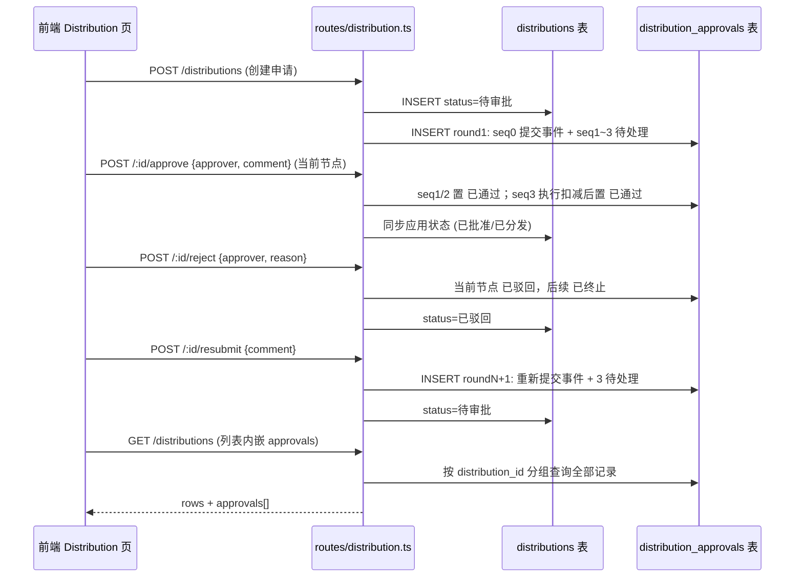

# 分发共享 · 全节点审批记录

Feature Name: distribution-approval-flow
Updated: 2026-09-28

## Description

将分发申请的单节点审批升级为三节点审批链（库管员初审 → 库负责人审批 → 分发执行），每个节点持久化审批角色、审批人、备注、操作时间与结果；驳回后申请人可重新提交开启新一轮；列表/详情内嵌全轮次节点记录；前端以差异化颜色标记节点状态与审批进度。

## Architecture



## Components and Interfaces

### 后端

**数据表**（`server/src/db.ts` migrate 追加）：

```sql
CREATE TABLE IF NOT EXISTS distribution_approvals (
  id TEXT PRIMARY KEY,               -- AP- 前缀
  distribution_id TEXT NOT NULL REFERENCES distributions(id),
  round INTEGER NOT NULL DEFAULT 1,
  seq INTEGER NOT NULL,              -- 0=提交/重新提交事件, 1=库管员初审, 2=库负责人审批, 3=分发执行
  node_name TEXT NOT NULL,
  role TEXT NOT NULL,                -- 申请人 / 库管员 / 库负责人
  approver TEXT NOT NULL,
  comment TEXT,
  status TEXT NOT NULL,              -- 已提交 / 待处理 / 已通过 / 已驳回 / 已终止
  acted_at TEXT,
  UNIQUE (distribution_id, round, seq)
);
```

**审批链定义**（`server/src/routes/distribution.ts`）：

```
APPROVAL_CHAIN = [
  { seq: 1, node_name: '库管员初审', role: '库管员' },
  { seq: 2, node_name: '库负责人审批', role: '库负责人' },
  { seq: 3, node_name: '分发执行', role: '库管员' },
]
ROLE_DEFAULT_APPROVER = { 库管员: '张伟', 库负责人: '王强' }
```

**核心逻辑**（`routes/distribution.ts`）：

- `currentRound(db, distId)` = 该申请最大 round；`currentNode` = 当前轮次中 seq 1~3 第一个「待处理」节点
- `actOnCurrentNode`：校验节点存在且为「待处理」，写入 approver（缺省按角色默认人）/comment/acted_at，状态置「已通过」，同步 `distributions.status`
- 节点 3 批准 = 执行分发：复用原 ship 逻辑（库存校验、扣减、纯活种子重算、预警）
- `resubmit`：仅「已驳回」可发起；新 round = max+1，插入重新提交事件 + 3 待处理节点，状态回「待审批」

**接口**：

| 方法 | 路径 | 变更 |
|------|------|------|
| GET | /api/distributions | 每条内嵌 `approvals: ApprovalNode[]`（一次查询分组，无 N+1） |
| GET | /api/distributions/:id | 内嵌 `approvals` |
| GET | /api/accessions/:id/distributions | 内嵌 `approvals` |
| POST | /api/distributions | 同事务插入 round1 全节点 |
| POST | /api/distributions/:id/approve | 请求体 `{ approver?, comment? }`，作用于当前节点；节点 3 即执行分发 |
| POST | /api/distributions/:id/reject | 请求体 `{ approver?, reason }`，当前节点驳回 + 后续终止 |
| POST | /api/distributions/:id/resubmit | 请求体 `{ comment? }`，仅已驳回可用 |
| POST | /api/distributions/:id/ship | 保留兼容，语义=批准当前节点（要求当前节点为 seq 3） |

**存量回填**（`seed.ts` 末尾幂等步骤，seed 跳过时也执行）：

| 申请状态 | 回填（round 1） |
|----------|----------------|
| 任意 | seq0 提交事件（已提交，approver=申请人，acted_at=applied_at） |
| 待审批 | seq1~3 待处理 |
| 已批准 | seq1/2 已通过（张伟/王强，备注「同意初审」/review_comment??「同意分发」），seq3 待处理 |
| 已分发 | seq1~3 均已通过（seq3 备注「已执行分发」） |
| 已驳回 | seq1 已驳回（张伟，备注 review_comment），seq2/3 已终止 |

**Mapper**：`toApprovalNode`（`lib/mappers.ts`）；`withApprovals(db, dists)` 组装。

### 前端

**类型**（`src/data/types.ts`）：

```ts
export type ApprovalNodeStatus = '已提交' | '待处理' | '已通过' | '已驳回' | '已终止'
export interface ApprovalNode {
  id: string
  round: number
  seq: number
  nodeName: string
  role: string
  approver: string
  comment: string | null
  status: ApprovalNodeStatus
  actedAt: string | null
}
// DistributionRequest 追加 approvals: ApprovalNode[]
```

**API**（`src/data/api.ts`）：`approveDistribution(id, {approver?, comment?})`、`rejectDistribution(id, {approver?, reason})`、`resubmitDistribution(id, comment?)`、`shipDistribution(id, {approver?, comment?})`。

**页面**（`src/pages/Distribution.tsx`）：

1. 列表新增「审批进度」列：当前轮次 `已通过数/3` + 3 个状态色点
2. 行操作：
   - 「审批记录」（所有状态）→ 弹框竖向时间线，按轮次分组（第 N 轮），每节点：状态色点 + 节点名 + 角色 Chip + 状态 Chip + 审批人 + 时间 + 备注
   - 待审批：「批准」「驳回」→ 动作弹框（审批人默认当前节点角色默认人；备注可选 / 驳回原因必填）
   - 已批准：「执行分发」→ 动作弹框（审批人 + 发货备注）
   - 已驳回：「重新提交」→ 动作弹框（重新提交说明可选）
3. 动作成功后用返回的 approvals 刷新行数据

**状态色**（`StatusChip.tsx` COLOR_MAP 追加）：

| 状态 | 颜色 |
|------|------|
| 已提交 | info |
| 待处理 | warning |
| 已通过 | success |
| 已驳回 | error |
| 已终止 | default(outlined) |

## Data Models

见上文表结构。`distributions.review_comment` 保留（存量兼容），新流程备注写入节点 `comment`。

## Correctness Properties

- 任一时刻每个申请的当前轮次至多一个「待处理」节点
- 应用状态与当前轮次节点一致：n1 待处理=待审批；n1/n2 通过且 n3 待处理=已批准；存在已驳回=已驳回；3 节点全通过=已分发
- 已动作节点不可再操作（409）
- 重新提交仅「已驳回」可用；新轮次 seq1~3 初始均为待处理
- 回填幂等（UNIQUE(distribution_id, round, seq) + 先查存在）

## Error Handling

- 对非当前节点/已动作节点操作：409「当前应处理节点为 seq N」
- 驳回原因为空：400
- 非「已驳回」重新提交：409
- ship 时当前节点非 seq 3：409
- 审批人未填写：按节点角色默认人填充（库管员=张伟、库负责人=王强）

## Test Strategy

`server/tests/distribution.test.ts` 扩展：

1. 创建申请自动生成 round1（seq0 已提交 + 3 待处理），列表内嵌 approvals
2. 顺序审批：n1 通过→n2 可操作；n2 通过→状态已批准
3. 乱序（直接操作非当前节点）→409
4. n1 驳回→申请已驳回、n2/n3 已终止、原因落库
5. 驳回原因为空→400
6. 驳回后重新提交→round2 生成、状态回待审批、round1 记录保留；非已驳回重新提交→409
7. 未全部通过时 ship→409；n2 通过后 ship（=批准 n3）→已分发 + 库存扣减
8. 存量回填：预置无节点旧状态数据，seed 后节点记录正确，重复 seed 幂等

前端手动验证：进度列、记录弹框（多轮）、动作弹框默认值、状态色。

## References

[^1]: (server/src/routes/distribution.ts#L57) - 现有单节点审批实现
[^2]: (server/src/db.ts#L80) - distributions 表结构
[^3]: (.cosmocode/specs/germplasm-resource-management/design.md) - 总体设计
