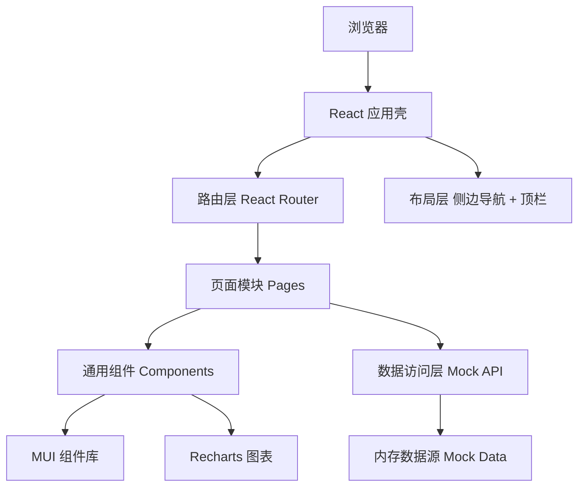

# 种质资源库智能管理系统 - 技术设计说明书

Feature Name: germplasm-resource-management
Updated: 2026-09-23

## 1. 描述

本设计说明书描述种质资源库智能管理系统的原型实现方案。原型聚焦于完整业务流程与交互验证，采用前后端分离思路，前端以 Mock 数据层模拟后端接口，后续可替换为真实 REST 服务。

## 2. 技术选型

| 层 | 选型 | 说明 |
|----|------|------|
| 构建 | Vite 5 + TypeScript | 快启动、按需构建 |
| 框架 | React 18 + React Router 6 | 组件化与前端路由 |
| UI | MUI 6（Material UI）+ @mui/icons-material | 中后台组件完善 |
| 图表 | Recharts | 轻量、声明式 | 
| 数据 | 本地 Mock 模块（`src/data`） | 无后端即可完整演示 |

## 3. 架构



设计原则：页面模块只依赖数据访问层，不直接依赖内存数据结构，便于后续把数据访问层替换为 HTTP 客户端。

## 4. 组件与接口

### 4.1 目录结构

```
src/
├── main.tsx                # 应用入口
├── App.tsx                 # 路由与主题装配
├── theme.ts                # MUI 主题
├── components/
│   ├── AppLayout.tsx       # 侧栏 + 顶栏布局
│   ├── StatCard.tsx        # 指标卡
│   ├── PageHeader.tsx      # 页头
│   └── StatusChip.tsx      # 状态标签
├── data/
│   ├── types.ts            # 领域类型定义
│   ├── mock.ts             # Mock 数据生成
│   └── api.ts              # 数据访问接口
└── pages/
    ├── Dashboard.tsx       # 驾驶舱
    ├── Accessions.tsx      # 种质资源
    ├── Inventory.tsx       # 库存管理
    ├── Viability.tsx       # 活力检测
    ├── Regeneration.tsx    # 繁育更新
    ├── Distribution.tsx    # 分发共享
    ├── Analytics.tsx       # 检索分析
    ├── Environment.tsx     # 环境监测
    ├── Alerts.tsx          # 预警中心
    └── System.tsx          # 系统管理
```

### 4.2 数据访问接口（Mock API）

```typescript
interface GermplasmApi {
  listAccessions(query: AccessionQuery): Promise<Accession[]>
  getAccession(id: string): Promise<Accession | undefined>
  listInventory(query?: InventoryQuery): Promise<InventoryLot[]>
  listViability(): Promise<ViabilityTest[]>
  listRegenerations(): Promise<Regeneration[]>
  listDistributions(): Promise<DistributionRequest[]>
  listEnvReadings(roomId: string): Promise<EnvReading[]>
  listAlerts(): Promise<Alert[]>
  getDashboardStats(): Promise<DashboardStats>
}
```

## 5. 数据模型

核心类型（`src/data/types.ts`）：

- `Accession`：编号、名称、学名、科、属、作物类别、来源类型、国家/地区、经纬度、海拔、采集人、采集日期、保存类型、状态、引种日期、存储量与活力摘要。
- `InventoryLot`：批次号、种质编号、库类型、货位、数量、单位、千粒重、含水量、入库日期、最近活力率、纯活种子、状态。
- `ViabilityTest`：检测号、批次号、种质编号、方法、重复数、每重复取样数、发芽数、活力率、检测日期、检测人。
- `Regeneration`：繁育单号、种质编号、原因、计划数量、地块、阶段、负责人、播种日期、预计收获、实际收获。
- `DistributionRequest`：申请单号、种质编号、批次号、申请人、单位、数量、用途、状态、申请日期、审批意见。
- `EnvReading`：库房、温度、湿度、采集时间。
- `Alert`：预警号、类型、级别、对象、描述、状态、产生时间。
- `AuditLog`：操作人、动作、对象类型、对象标识、时间、IP。
- `User`、`Role`：账号、姓名、角色、状态。

## 6. 关键计算规则

1. **活力率**：`活力率 = 各重复发芽数之和 / (重复数 × 每重复取样数)`。
2. **纯活种子**：`纯活种子 = 库存数量 × 最近活力率`。
3. **库存状态**：低于分发临界量判定为"偏低"；等于 0 判定为"耗尽"；否则为"正常"。
4. **预警生成**：
   - 库存不足：数量 < 分发临界量；
   - 活力下降：活力率 < 阈值（默认 75%）；
   - 存储超期：距入库时长 > 库类型保存年限；
   - 环境异常：温度或湿度超出库类型上下限；
   - 设备离线：距上次上报 > 设定时长。

## 7. 正确性属性（不变量）

1. 任一 `InventoryLot.accessionId` 必须存在于 `Accession` 集合。
2. 任一 `ViabilityTest.lotId` 必须存在于 `InventoryLot` 集合。
3. `InventoryLot.pureLiveSeed` 始终等于 `quantity × latestViabilityRate`。
4. 库存数量在任何出库操作后非负。
5. 同一时刻一个物理货位至多被一个 `active` 状态批次占用。
6. 所有审批、分发、出入库操作在 `AuditLog` 中都有对应记录。

## 8. 错误处理

| 场景 | 处理策略 |
|------|----------|
| 必填字段缺失 | 表单内联校验并阻止提交 |
| 出库数量超可用量 | 阻止提交并提示可用数量 |
| 货位冲突 | 提示占用批次并建议邻近货位 |
| 数据加载失败 | 展示错误态与重试按钮 |
| 无权限操作 | 隐藏或禁用入口并提示角色不足 |

## 9. 测试策略

- 单元测试：活力率与纯活种子的计算函数、库存状态判定函数。
- 组件测试：表单校验、状态标签渲染、预警徽标计数。
- 集成测试：以 Mock API 驱动页面路由切换，验证数据贯通。
- 手工验收：按 PRD 第 5 章验收标准逐条走查。

## 10. 后续演进

原型完成后，将 `src/data/api.ts` 替换为真实 HTTP 客户端，接入 Spring Boot / Node.js 后端与 PostgreSQL/MySQL；移动端复用同一套 REST 接口实现 PDA 扫码；设备接入层通过 MQTT 上报温湿度数据。

## 参考

[^1]: (Website) - [GRIN-Global Inventory Documentation](https://www.grin-global.org/docs/gg_inventory.pdf)
[^2]: (Website) - [GRIN-Global Accessions / Passport Data](https://www.grin-global.org/docs/gg_accessions_and_passport_data.pdf)
[^3]: (Website) - [ICARDA Genetic Resources](https://icarda.org/research/genetic-resources)
