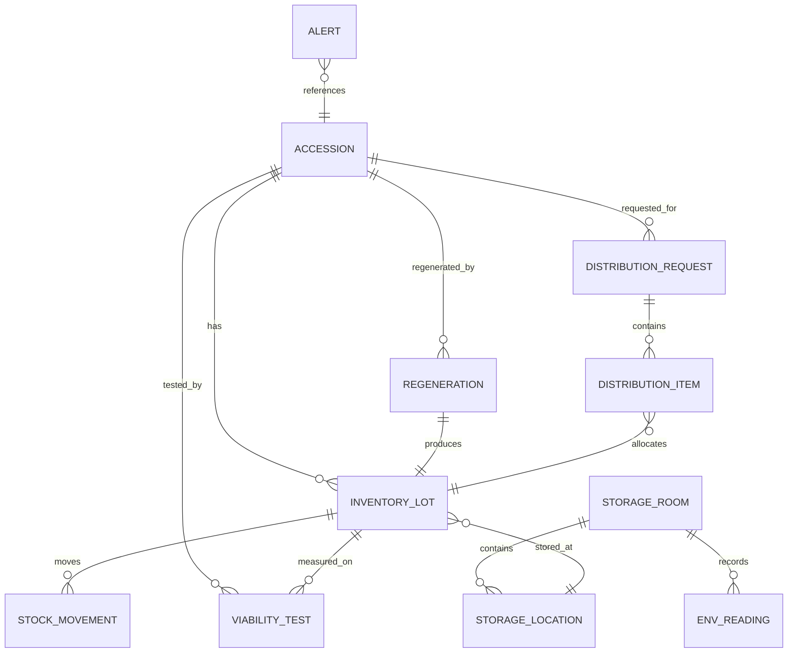

# 种质资源库智能管理系统 - 产品需求文档（PRD）

Feature Name: germplasm-resource-management
Updated: 2026-09-23

## 1. 背景与目标

种植资源的收集、保存与共享是育种与生物多样性保护的底座。当前多数单位仍依赖 Excel 台账与纸质记录，存在库存数量不准、活力数据缺失、繁育更新无计划、分发无追溯、库房环境无监控等问题。

本系统面向农业科研院所、种业企业、农作物/林木种质库，提供从**种质登记 → 库存入库 → 活力检测 → 繁育更新 → 分发共享**的全生命周期数字化管理能力，并通过预警中心与数据驾驶舱实现"智"的管理。

### 目标

- 建立种质（Accession）与库存批次（Inventory Lot）分离的规范数据模型，保证账实一致。
- 以二维码为载体实现样品全流程追溯。
- 用"纯活种子（Pure Live Seed）"口径管理可分发库存，而非简单数量口径。
- 通过库存、活力、存储时长、环境四类预警降低种质损失风险。
- 沉淀检索与统计能力，支撑资源评价与共享决策。

## 2. 参考的开源项目与行业实践

| 来源 | 借鉴点 |
|------|--------|
| GRIN-Global（美国农业部种质资源信息网络，开源） | Accession 与 Inventory 分离模型、多作物护照描述符（MCPD）、纯活种子计算、活力检测（Viability Wizard）、繁育更新与分发订单 |
| Genesys / ICARDA Genebank | 全球种质门户式检索、种质申请与进度追踪、气候与性状分析（FIGS） |
| 国内种质库厂商方案（如联智、农博士、智轩云） | 条码/PDA 扫码出入库、货位（库-柜-层-位）管理、温湿度监测与声光/短信报警、多类型库（长期库/中期库/短期库/复份库） |
| AOSA / Handbook of Seed Technology for Genebanks | 标准发芽试验规程、重复取样的活力检测方法 |

## 3. 术语表（Glossary）

- **种质（Accession）**：一份具有独立身份和来源的种质材料，是全库管理的逻辑主体。
- **库存批次（Inventory Lot）**：种质的实体种子样本，一份种质可对应多个批次，是出入库与分发的实体单位。
- **护照数据（Passport Data）**：种质的来源信息，包含采集地、采集人、经纬度、海拔、来源类型等。
- **纯活种子（Pure Live Seed, PLS）**：库存数量与最近活力率（发芽率）的乘积，表示真正具备萌发能力的种子数。
- **活力率（Viability Rate）**：发芽试验或染色试验测得的可萌发种子占比。
- **繁育更新（Regeneration）**：为补充库存、维持活力或恢复遗传完整性而进行的再繁殖过程。
- **分发临界量（Distribution Critical Amount）**：低于该数量时触发补库预警的库存阈值。
- **货位（Storage Location）**：库房-存贮柜-层-位的四级编码位置。
- **库类型**：长期库、中期库、短期库、复份库、离体库等，对应不同温湿度与保存年限。
- **角色（Role）**：系统权限集合，决定用户可执行的操作范围。

## 4. 用户角色

| 角色 | 主要诉求 |
|------|----------|
| 库管员 | 高效完成登记、出入库、扫码盘点与货位管理 |
| 种质研究/育种人员 | 检索种质、查看性状与活力、发起分发申请、登记繁育与检测数据 |
| 库负责人/审批人 | 审批分发与繁育计划、查看库存与风险预警 |
| 系统管理员 | 维护用户、角色权限、数据字典与审计追溯 |
| 访客/共享用户 | 在授权范围内检索与浏览种质公开信息 |

## 5. 功能需求

### 需求 1：种质资源登记

**User Story：** AS 库管员，I want 登记种质及其护照数据，so that 每份材料都有唯一身份与来源档案。

#### 验收标准

1. WHEN 库管员提交种质登记表单，the 系统 SHALL 自动生成全局唯一且不可重复的种质编号。
2. WHEN 种质编号生成后，the 系统 SHALL 根据编号生成唯一二维码并支持打印标签。
3. WHILE 录入护照数据时，the 系统 SHALL 提供学名、科属、来源类型、国家/地区、经纬度、海拔、采集人、采集日期的结构化字段。
4. IF 提交的种质缺少学名或来源类型，the 系统 SHALL 拒绝保存并提示缺失字段。
5. WHEN 库管员编辑已存在的种质，the 系统 SHALL 记录修改前后的差异到审计日志。

### 需求 2：库存入库与货位管理

**User Story：** AS 库管员，I want 将种子按批次入库并绑定货位，so that 实体库存可被准确定位与计数。

#### 验收标准

1. WHEN 库管员为某份种质创建库存批次，the 系统 SHALL 生成库存批次号并关联该种质编号。
2. WHEN 批次入库时，the 系统 SHALL 记录库类型、货位（库房-存贮柜-层-位）、入库数量、千粒重、含水量、入库日期。
3. WHILE 指定货位已被占用，the 系统 SHALL 展示该货位现有批次并阻止重复占用同一物理位置。
4. WHEN 库管员扫描批次二维码，the 系统 SHALL 返回该批次的种质、数量、货位与活力信息。
5. WHEN 库管员执行移库，the 系统 SHALL 更新批次货位并生成移库流水。

### 需求 3：出库与库存调整

**User Story：** AS 库管员，I want 规范处理出库、报废与盘盈亏，so that 库存数量与实物一致。

#### 验收标准

1. WHEN 库管员提交出库单，the 系统 SHALL 校验批次可用数量并扣减库存。
2. IF 出库数量大于批次当前数量，the 系统 SHALL 拒绝出库并提示可用数量。
3. WHEN 库管员完成盘点，the 系统 SHALL 记录账面数量、实盘数量与差异原因。
4. WHEN 出库单完成，the 系统 SHALL 生成出库流水并关联操作人与时间。

### 需求 4：活力检测（发芽试验）

**User Story：** AS 种质研究人员，I want 登记发芽/染色试验结果，so that 库存以纯活种子口径被评估。

#### 验收标准

1. WHEN 研究人员登记一次活力检测，the 系统 SHALL 记录检测方法、重复数、每重复取样数、发芽数、检测日期与检测人。
2. WHEN 一次检测包含多个重复，the 系统 SHALL 以各重复发芽数之和除以取样总数计算活力率。
3. WHEN 活力率计算完成，the 系统 SHALL 将最近一次活力率写入对应库存批次。
4. WHEN 库存批次被查询，the 系统 SHALL 以库存数量乘以最近活力率计算并展示纯活种子数。
5. IF 同一批次在 24 个月（可配置）内未做活力检测，the 系统 SHALL 生成活力复检预警。

### 需求 5：繁育更新

**User Story：** AS 种质研究人员，I want 制定并执行繁育更新计划，so that 库存得到补充且遗传完整性得到维持。

#### 验收标准

1. WHEN 研究人员创建繁育计划，the 系统 SHALL 记录目标种质、繁育原因、计划数量、地块、播种日期与负责人。
2. WHEN 繁育进入不同阶段，the 系统 SHALL 支持计划、播种、田间管理、收获、入库的阶段流转。
3. WHEN 繁育收获入库完成，the 系统 SHALL 自动创建新的库存批次并关联原种质与来源繁育单。
4. WHILE 库存低于分发临界量或活力率低于阈值，the 系统 SHALL 在繁育待办中提示优先安排更新。
5. WHEN 繁育计划被关闭，the 系统 SHALL 记录实际收获量与更新结论。

### 需求 6：分发与共享

**User Story：** AS 育种人员，I want 在线申请并跟踪种质分发，so that 材料共享合规且可追溯。

#### 验收标准

1. WHEN 申请人在线提交分发申请，the 系统 SHALL 记录申请种质、申请数量、用途、申请人单位与联系方式。
2. WHEN 分发申请提交后，the 系统 SHALL 进入审批流程并通知审批人。
3. WHEN 审批通过，the 系统 SHALL 允许库管员执行分发并扣减对应批次库存。
4. WHEN 分发执行完成，the 系统 SHALL 记录分发批次、数量、快递单号与分发日期。
5. IF 审批被驳回，the 系统 SHALL 记录驳回原因并通知申请人。
6. WHEN 分发数量导致库存低于分发临界量，the 系统 SHALL 生成补库预警。

### 需求 7：检索与统计分析

**User Story：** AS 种质研究人员，I want 多条件检索与统计分析，so that 快速定位资源并了解库存结构。

#### 验收标准

1. WHEN 用户输入关键词，the 系统 SHALL 在种质编号、名称、学名、来源等字段进行模糊匹配。
2. WHEN 用户组合筛选条件（作物、来源类型、库类型、活力区间、采集地），the 系统 SHALL 返回同时满足全部条件的结果。
3. WHEN 用户查看统计视图，the 系统 SHALL 按作物类别、库类型、来源类型、年度入库量提供图表。
4. WHEN 用户查看活力分布，the 系统 SHALL 提供活力率区间分布直方图。
5. WHEN 用户导出检索结果，the 系统 SHALL 生成包含当前筛选条件的数据文件。

### 需求 8：库房环境监测

**User Story：** AS 库负责人，I want 监控库房温湿度与设备状态，so that 保存条件持续合规。

#### 验收标准

1. WHEN 采集设备上报数据，the 系统 SHALL 按库房记录温度、湿度与采集时间。
2. WHEN 用户查看某库房，the 系统 SHALL 展示实时值与近 24 小时趋势曲线。
3. IF 温湿度超出库类型设定的上下限，the 系统 SHALL 生成环境告警。
4. WHEN 设备离线超过设定时长，the 系统 SHALL 生成设备离线告警。

### 需求 9：预警中心

**User Story：** AS 库负责人，I want 集中查看并处理风险预警，so that 风险被及时闭环。

#### 验收标准

1. WHEN 发生库存不足、活力下降、存储超期或环境异常，the 系统 SHALL 生成对应类型的预警记录。
2. WHEN 用户打开预警中心，the 系统 SHALL 按类型、级别、状态展示预警列表。
3. WHEN 用户处理预警，the 系统 SHALL 支持标记处理中与已闭环并记录处理说明。
4. WHILE 存在未闭环的严重级预警，the 系统 SHALL 在导航入口展示未处理数量徽标。

### 需求 10：权限与审计

**User Story：** AS 系统管理员，I want 管理用户角色与操作审计，so that 数据访问合规。

#### 验收标准

1. WHEN 管理员创建用户，the 系统 SHALL 为用户分配一个或多个角色。
2. WHEN 用户执行操作，the 系统 SHALL 依据角色校验权限并在无权限时拒绝操作。
3. WHEN 用户执行新增、修改、删除、审批、分发等关键操作，the 系统 SHALL 写入审计日志，记录操作人、时间、对象与动作。
4. WHEN 管理员查看审计日志，the 系统 SHALL 支持按操作人、对象类型与时间范围筛选。

### 需求 11：数据驾驶舱

**User Story：** AS 库负责人，I want 一屏总览核心指标，so that 快速掌握全库运行状况。

#### 验收标准

1. WHEN 用户进入首页，the 系统 SHALL 展示种质总数、库存批次数、可分发批次数、预警数等核心指标卡。
2. WHEN 首页加载完成，the 系统 SHALL 展示近 12 个月入库量趋势与作物类别分布。
3. WHEN 首页加载完成，the 系统 SHALL 展示待办事项（待审批分发、待复检活力、待繁育）。

## 6. 非功能需求

1. **性能**：在 10 万份种质、50 万个库存批次的规模下，常规列表查询响应时间 SHALL 不超过 2 秒。
2. **可用性**：系统在库房网络中断时，移动端扫码端 SHALL 支持离线暂存并在网络恢复后同步。
3. **安全**：系统 SHALL 对传输数据使用 HTTPS，对用户口令使用加盐哈希存储。
4. **可追溯**：系统 SHALL 对每份种质提供从采集到分发的完整事件时间线。
5. **兼容性**：Web 端 SHALL 支持 Chrome、Edge 最新版本；移动端 SHALL 支持主流浏览器扫码。
6. **可扩展**：系统 SHALL 支持新增库房、库类型与作物类别的字典化配置，无需改代码。

## 7. 核心数据模型

## 8. 迭代规划

| 迭代 | 范围 |
|------|------|
| MVP（本次原型） | 驾驶舱、种质登记、库存管理、活力检测、繁育更新、分发共享、检索分析、环境监测、预警中心、系统管理 |
| V1.1 | 扫码 PDA 端、离线暂存同步、真实设备接入 |
| V1.2 | 遗传多样性分析与 FIGS 类性状挖掘、与国家种质平台数据交换 |
